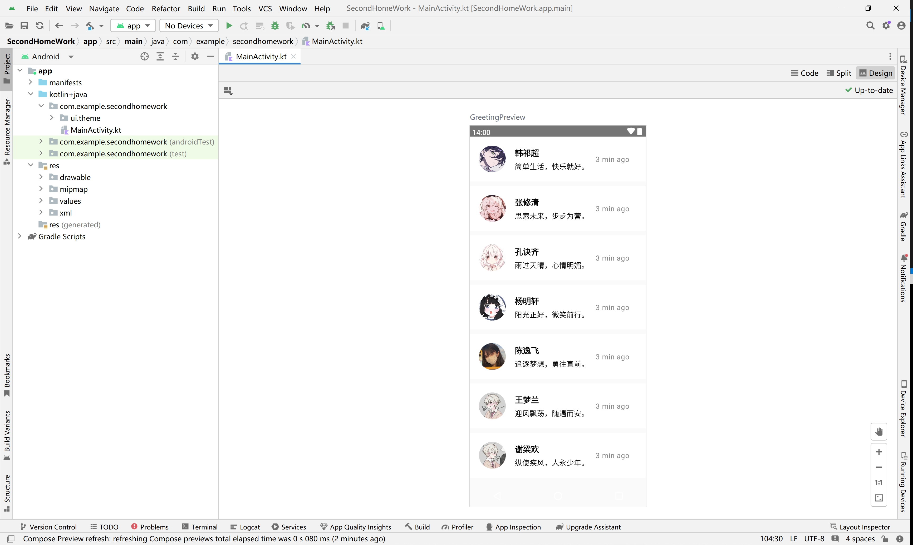

## 即时通讯

## 作业要求，请同学们参考以下预览截图，进行开发复现

请使用以下关键技术进行开发，使得你的代码看起来非常干净
- 类
- 可组合函数 @Composable
- repeat

## 提交方式

在第一次作业时所创建的远端仓库，通过 Git 提交，提交完毕后你的文件系统树应该长这样：

- Android Class Work
    - 第一次作业
        - MainActivity.kt
        - Android Studio 演示截图
    - 第二次作业
        - MainActivity.kt
        - Android Studio 演示截图

## 提交截止日期：

- 计算机223班：2024.03.27 00:00 UTC+8
- 计算机225班：2024.03.27 00:00 UTC+8
- 计算机226&227班：2024.03.27 00:00 UTC+8